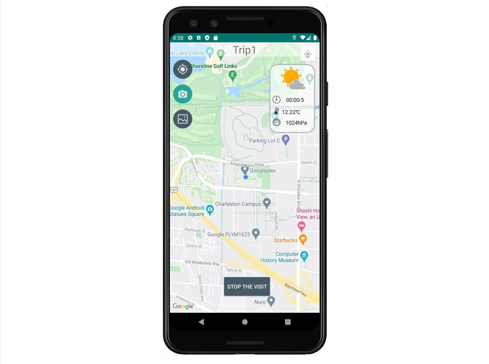

# COM31007 Software Development for Mobile Devices Assignment Report

## 1. Overview

In this project, we make good use of the MVVM model and Room Database. Specifically, the view is mainly responsible for UI rendering, the Model corresponds to the data model of the entity, the ViewModel mainly deals with business logic and it is responsible for the interaction between the View and Model, and the View layer to achieve two-way binding.

**Programming Language:** As third-level students, we are more familiar and confident with Java and in order to make the development process smoother, we used Java to implement the application rather than Kotlin.

**Android Version: it can work on Android 5.0 (include 5.0) and above min SDK 21. Most of the tests have been done on** **AVD Pixel 3 API 29** **when we build this project.**

## 2. Details of Tasks

### 2.1 Taking photos and Map integration

- The Google map is implemented which is easy to use, understand, and navigate. And on the top right of the map view, it provides **barometric** **pressure**, **temperature**, and **timer** information. (see Figure.1 below)

- The app allows users to take pictures using a camera when they use the map. This functionality can both work on a **real device** and on the **emulator**.

- The function of taking pictures can not be used if the **real device** and **emulator** does not have a camera. Instead, users can select pictures and upload new pictures from the gallery.

  

### 2.2 Capture a visit and trip planning

- A trip will start after the user enters the title and click start, the time elapses will be recorded at the same time, temperature and barometric pressure will keep updating while the trip is ongoing.

### 2.3 Visually browse previews of photos

- The app allows visualising previews of the pictures on the history page.
- The app allows selecting a picture for further detailed inspection including **title**, the **time elapsed**, **date**, **weather**, **location**.
- The app interface is efficient and able to cope with a library of thousands of photos.
- The photo can also be accessed in sorting by time (newest to oldest).

### 2.4 Persisting data in a local database

- The database must allow the searching of images based on keywords in the title. The fuzzy search function is implemented by traversing the query and checking whether the search is contained within the target range.
- All the data captured during the visit are saved in a local database implemented using **Room**.

- 

### 2.5 Showing pictures on a map

- A thumbnail will be shown on the map after a photo is taken(see Figure.2), previews of photos can be seen after **clicking them** on the map(see Figure.3).
- The interface provides a button to locate the user’s current location on the map.
- The app can show the location on the map and show the details of the photo when tapped on.

1. 

2. 

### 2.6 Additional functionalities

- The barometric pressure and temperature can be recorded from the phone’s sensors when readings at the time of taking the picture.
- The full-size (larger version) photos can be found when clicking the photos on the history page.
- The night mode is also implemented in this system, and it is placed in the bottom right of the page on a circular button with a moon icon.
- All the pictures can be searched by their title.

### 2.7 Code style and documentation

- The naming and format are in a consistent format regarding class and variable naming as well as indentation.
- The comments and JavaDoc are well organized.

1. 